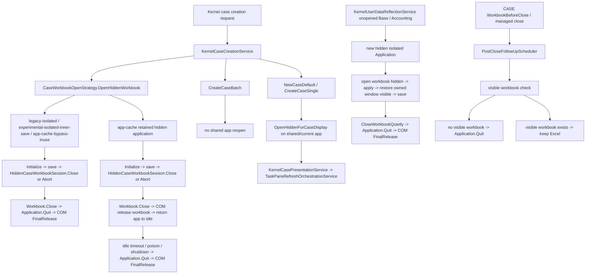

# Hidden Excel / Isolated App / White Excel Lifecycle Current State

## 位置づけ

この文書は、hidden Excel / isolated app / retained hidden app-cache / white Excel lifecycle の current-state 正本です。現行 `main` で確認できる owner、cleanup、visibility、close / reopen 接続点を protocol 単位で固定します。

- 基準コード: `2026-05-08` 作業開始時点で `main` / `origin/main` / `HEAD` が一致した `b9a0f6ad90c607b7fac92b5fbf03f02e90b03390`
- 参照した正本:
  - `docs/architecture.md`
  - `docs/flows.md`
  - `docs/ui-policy.md`
  - `docs/case-display-recovery-protocol-current-state.md`
  - `docs/case-display-recovery-protocol-target-state.md`
  - `docs/case-workbook-lifecycle-current-state.md`
  - `docs/a2-window-visibility-current-state.md`
  - `docs/workbook-window-activation-notes.md`
  - `docs/taskpane-refresh-policy.md`
- 主な確認対象:
  - `CaseWorkbookOpenStrategy`
  - `KernelCaseCreationService`
  - `KernelCasePresentationService`
  - `KernelUserDataReflectionService`
  - `AccountingSetKernelSyncService`
  - `WorkbookWindowVisibilityService`
  - `ExcelWindowRecoveryService`
  - `TaskPaneRefreshOrchestrationService`
  - `WindowActivatePaneHandlingService`
  - `WorkbookLifecycleCoordinator`
  - `CaseWorkbookLifecycleService`
  - `PostCloseFollowUpScheduler`
  - `ThisAddIn`

この文書は current-state を記録するだけです。コード変更、Excel visibility 制御変更、hidden cleanup 条件変更、WorkbookClose / reopen 条件変更、foreground / visibility / rebuild / refresh source 条件変更は行いません。

## H current-state consolidation index

A-G 完了後の current-state docs は、次の関係で読む。

### source-of-truth docs

- この文書
  - hidden Excel / isolated app / retained hidden app-cache / white Excel lifecycle の top-level current-state 正本。
  - owner、cleanup、visibility、WorkbookClose / reopen、white Excel prevention との接続点を protocol 単位で固定する。
- `docs/hidden-excel-lifecycle-outcome-vocabulary.md`
  - lifecycle term、normalized outcome、owner vocabulary、trace vocabulary の正本。
  - `raw facts` と `normalized outcome`、`trace owner` と `action owner`、`recovery owner` と `cleanup owner` を分ける。

### reference docs

- `docs/architecture.md`、`docs/flows.md`、`docs/ui-policy.md`
  - system structure / flow / UI policy の前提。
  - lifecycle current-state の詳細 owner はこの文書と detail docs を参照する。
- `docs/lifecycle-redesign-cross-review.md`
  - A-G 完了後レビューと H へ進む前の gap map。
  - H 後の current-state 正本ではなく、次フェーズ判断の履歴 reference として読む。
- `docs/hidden-excel-isolated-app-white-excel-lifecycle-target-state.md`、`docs/case-display-recovery-protocol-target-state.md`
  - target-state reference。
  - target-only outcome や未実装 protocol を current emitted outcome として読まない。

### detail docs

- `docs/workbook-close-reopen-protocol-current-mapping.md`
  - WorkbookClose / reopen / post-close follow-up の detail current mapping。
- `docs/visibility-foreground-boundary-current-state.md`
  - visibility restore / visibility recovery / foreground guarantee の detail current-state。
- `docs/white-excel-prevention-boundary-current-state.md`
  - white Excel prevention の detail current-state。white Excel recovery UX は current-state では未定義。
- `docs/case-workbook-lifecycle-current-state.md`
  - `CaseWorkbookLifecycleService`、managed close、post-close quit の lifecycle service detail。
- `docs/case-display-recovery-protocol-current-state.md`
  - CASE display / recovery / ready-show / rebuild fallback / refresh source / WindowActivate の detail current-state。

### 読み方

- detail docs が同じ禁止事項や owner 境界を繰り返す場合、用語は `docs/hidden-excel-lifecycle-outcome-vocabulary.md`、top-level lifecycle 関係はこの文書、protocol 固有の raw facts は各 detail doc を正本にする。
- `visibility restore` は docs vocabulary の umbrella term、`VisibilityRecoveryOutcome` / `visibility recovery` は current code / trace vocabulary として扱う。
- `white Excel prevention` は現行 runtime の close / quit protocol。`white Excel recovery` は user-facing UX / manual guidance が未定義の領域として扱う。
- `case-display-completed` は `TaskPaneRefreshOrchestrationService` の created-case display session terminal trace。`WindowActivate`、pane visible、foreground guarantee、hidden cleanup、white Excel prevention の別名にしない。

## current-state summary

- 既定は shared/current app です。業務処理側は利用者が操作中の Excel `Application` を原則 quit しません。
- hidden Excel / isolated app は一般的な表示制御手段ではありません。許容されるのは、owner と cleanup が閉じた managed hidden session だけです。
- CASE 新規作成の hidden create session は `KernelCaseCreationService` が session owner、`CaseWorkbookOpenStrategy` が hidden workbook open / close mechanics owner です。
- retained hidden app-cache は `CaseWorkbookOpenStrategy` だけが持つ例外です。workbook close は session close、cached `Application` の return-to-idle / timeout / poison / shutdown cleanup は cache owner が持ちます。
- `KernelUserDataReflectionService` の未 open Base / Accounting 反映は、service-owned isolated app を作り、save 前に owned workbook window visibility を restore し、close / quit / COM final release まで service 内で閉じます。
- `AccountingSetKernelSyncService` は専用 isolated app fallback を持ちません。未 open 会計 workbook も current application で開き、自分で開いた workbook だけ hidden window のまま反映して close します。
- created CASE の interactive 表示は、hidden create session の close 後に shared/current app の hidden-for-display reopen へ移ります。以後の表示、foreground、TaskPane completion は display / refresh protocol 側が扱います。
- 実機確認では、interactive hidden create session 中に保存前正規化として `window.Visible=true` を実行すると白フラッシュと終了時 Excel / Book1 発生が再露出し、visible 化を presentation owner へ遅延すると解消しました。このため hidden create session owner / close owner / shared app handoff は動かさず、CASE workbook window は final presentation まで premature visible にしません。
- white Excel 防止は close / quit 側の設計目標です。現行 owner は `PostCloseFollowUpScheduler` であり、`WindowActivate`、foreground recovery、visibility recovery の代替ではありません。
- `WorkbookActivate` / `WindowActivate` は display / refresh trigger です。hidden session cleanup、retained instance cleanup、white Excel cleanup、foreground guarantee owner ではありません。
- white Excel prevention / recovery の G-0 current-state と target boundary は `docs/white-excel-prevention-boundary-current-state.md` を参照します。

### route decision service boundary

- CASE workbook open の route / hidden route decision は `CaseWorkbookOpenRouteDecisionService` に分離しています。
- これは owner / lifecycle の移動ではありません。Excel app lifecycle、hidden session owner、workbook close owner、retained app-cache cleanup owner、COM release owner は引き続き `CaseWorkbookOpenStrategy` 側に残ります。
- `CaseWorkbookOpenRouteDecisionService` は環境変数・暫定 switch の解釈、selected route、save-before-close、fallback、application owner facts、route trace details の値化だけを担当します。
- 目的は大型の open strategy class から route 判断責務を減らし、CASE workbook open route 変更時の影響範囲を小さくすることです。

### cleanup outcome service boundary

- CASE workbook open の cleanup / retained app-cache outcome 分類は `CaseWorkbookOpenCleanupOutcomeService` に分離しています。
- これは cleanup owner / lifecycle の移動ではありません。Excel app lifecycle、hidden session owner、workbook close owner、cleanup 実行 owner、retained app-cache owner、COM release owner は引き続き `CaseWorkbookOpenStrategy` 側に残ります。
- `CaseWorkbookOpenCleanupOutcomeService` は cleanup 実行後の raw facts から hidden cleanup outcome、isolated app outcome、retained instance outcome、reason、diagnostic / trace details を値として組み立てるだけを担当します。
- 目的は大型の open strategy class から cleanup 分類責務を減らし、cleanup / retained app-cache outcome の変更影響範囲を小さくすることです。

### presentation handoff service boundary

- CASE workbook open 後の display recovery / presentation handoff の判断・材料組み立ては `CaseWorkbookPresentationHandoffService` に分離しています。
- これは表示操作 owner / lifecycle の移動ではありません。`Application.Visible`、`WindowState`、workbook / window activate、CASE 表示 recovery 実行 owner、presentation handoff 実行 owner は引き続き `CaseWorkbookOpenStrategy` と既存 presentation / recovery service 側に残ります。
- `CaseWorkbookPresentationHandoffService` は hidden-for-display の shared app state facts、previous window restore decision、handoff diagnostic details、visible-open 時の application / workbook / window visibility facts を値として組み立てるだけを担当します。
- 目的は大型の open strategy class から表示復旧判断・材料整理の責務を減らし、hidden route から visible presentation へ渡す直前の変更影響範囲を小さくすることです。

### hidden app lifecycle support service boundary

- retained hidden app-cache 周辺の reusable facts、idle expiration decision、return-to-idle / poison / timeout / shutdown cleanup の reason / diagnostic / trace message 組み立ては `CaseWorkbookHiddenAppLifecycleSupportService` に分離しています。
- これは hidden app lifecycle owner の移動ではありません。retained app-cache owner、idle timer owner、poison owner、shutdown cleanup owner、workbook close owner、`Application.Quit` owner、COM release owner は引き続き `CaseWorkbookOpenStrategy` 側に残ります。
- `CaseWorkbookHiddenAppLifecycleSupportService` は cached `Application` の raw visibility / health facts、reuse block reason、expiration classification、retained cache trace details を値として組み立てるだけを担当します。
- 目的は大型の open strategy class から hidden app lifecycle 周辺の補助責務を減らし、retained app-cache 条件や trace vocabulary を変更する場合の影響範囲を小さくすることです。

### CaseWorkbookOpenStrategy large class boundary freeze

今回の分割は責務統合ではなく、判断・分類・facts / trace 組み立ての collaborator 化です。owner / lifecycle / close / app quit / COM release は `CaseWorkbookOpenStrategy` から安易に移動していません。

`CaseWorkbookOpenStrategy` に残る owner:

- Excel application 作成
- workbook open / close
- hidden session owner
- isolated app lifecycle
- shared app handoff
- retained app-cache owner
- cleanup 実行
- app quit
- COM release
- CASE 表示 recovery

collaborator に移った責務:

- `CaseWorkbookOpenRouteDecisionService`: route decision、環境変数・暫定 switch の解釈、selected route、application owner facts、route trace details
- `CaseWorkbookOpenCleanupOutcomeService`: cleanup outcome 分類、hidden cleanup outcome、isolated app outcome、retained instance outcome、reason、diagnostic / trace details
- `CaseWorkbookPresentationHandoffService`: presentation handoff facts、shared app state facts、previous window restore decision、visible-open visibility facts
- `CaseWorkbookHiddenAppLifecycleSupportService`: hidden app lifecycle support facts / reason / trace、reuse block reason、expiration classification、retained cache trace details

次に追加削減を行う場合も、owner / lifecycle を動かさず切れる場合に限ります。実機安定化済みの hidden Excel / white Excel / Book1 / close lifecycle / TaskPane lifecycle は不用意に変更しません。

## instance lifecycle 整理

### shared/current app

shared/current app は、Add-in が接続している利用者操作中の `Application` です。

- created CASE の display reopen は `CaseWorkbookOpenStrategy.OpenHiddenForCaseDisplay(...)` で shared/current app 上に開きます。
- `OpenHiddenForCaseDisplay(...)` は `ScreenUpdating` / `EnableEvents` / `DisplayAlerts` を一時的に false にし、opened workbook window を hidden にして、必要なら previous active window を restore します。
- shared/current app の application state は `RestoreSharedApplicationState(...)` で戻します。
- shared/current app 上で開いた workbook の最終表示責務は `KernelCasePresentationService`、`WorkbookWindowVisibilityService`、`ExcelWindowRecoveryService`、`TaskPaneRefreshOrchestrationService` へ引き継がれます。
- shared/current app を使う経路では、原則として caller-owned `Application` を quit しません。例外は post-close white Excel 防止の no visible workbook quit です。

### isolated app

isolated app は、処理 owner が生成し、cleanup まで完結させる専用 `Application` です。

- `CaseWorkbookOpenStrategy` の dedicated hidden create route:
  - `legacy-isolated`
  - `experimental-isolated-inner-save`
  - `app-cache-bypass-inuse`
- `KernelUserDataReflectionService` の managed hidden reflection session。

isolated app の cleanup 原則:

- owner が `Workbook.Close` を行います。
- owner が `Application.Quit` を行います。
- owner が COM final release を行います。
- close / quit / release を `WindowActivate`、TaskPane refresh、foreground recovery へ委譲しません。

### retained hidden app-cache

retained hidden app-cache は `CaseWorkbookOpenStrategy` の例外境界です。

- 有効化条件は `CASEINFO_EXPERIMENT_HIDDEN_APP_CACHE` です。
- idle timeout は `CASEINFO_EXPERIMENT_HIDDEN_APP_CACHE_IDLE_SECONDS`、未設定時は 15 秒です。
- cache が空なら hidden `Application` を作成して保持します。
- cache が空でなく healthy なら再利用します。
- cache が in-use の場合は `app-cache-bypass-inuse` として dedicated hidden session へ逃がします。
- session close では workbook を close し、workbook COM を release します。
- cached `Application` は healthy なら idle に戻します。
- poison / unhealthy / timeout / feature flag disabled / shutdown では cached `Application` を quit して release します。
- `ThisAddIn_Shutdown` は `CaseWorkbookOpenStrategy.ShutdownHiddenApplicationCache()` を呼びます。

retained hidden app-cache は one-shot isolated lifecycle ではありません。このため orphaned `EXCEL.EXE` の運用監視は残課題ですが、現行 protocol では cache owner 以外が retained instance を破棄しません。

### retained instance cleanup protocol（D-0 current-state）

2026-05-09 の D フェーズ棚卸しでは、開始時 `main` / `origin/main` / `HEAD` が `346b3b33bce887c8de245f42657110483356f7fd` で一致した状態を前提に、`CaseWorkbookOpenStrategy` と `CaseWorkbookOpenStrategyTests` の retained hidden app-cache 周辺だけを確認しました。この節は現行条件の記録であり、cache 有効条件、idle timeout 値、poison 条件、shutdown cleanup 条件、shared/current app quit 条件は変更しません。

| protocol | owner / trigger | current-state action | trace / outcome facts | 境界 |
| --- | --- | --- | --- | --- |
| return-to-idle | `CleanupCachedHiddenSession(...)` が app-cache route の session close を扱い、owned workbook close / release 後に `TryReturnCachedHiddenApplicationToIdle(...)` を呼ぶ。 | cache が有効、slot が同一 `Application`、cache-owned、hidden state reapply と health check が成功した場合だけ `IsInUse=false`、`IdleSinceUtc=DateTime.UtcNow`、idle timer schedule に戻す。`Application.Quit` は行わない。 | `hidden-excel-cleanup-outcome` に `hiddenCleanupOutcome=HiddenExcelCleanupCompleted` と `retainedInstanceOutcome=RetainedInstanceReturnedToIdle`、`cacheReturnedToIdle=True` が出る。 | hidden session cleanup 完了であり、retained cached app cleanup 完了ではない。 |
| poison | abort、workbook close failure、return-to-idle failure、return-to-idle health check failure、open failure cleanup など、cache owner が cached app を再利用不可と判断した場合。 | `MarkCachedHiddenApplicationPoisoned(...)` が slot を cache から外し、idle timer を止め、`DisposeCachedHiddenApplicationSlot(..., "poisoned")` へ渡す。 | `hidden-excel-cleanup-outcome` には `retainedInstanceOutcome=RetainedInstancePoisoned`、`cachePoisoned=True` が出る。slot disposal 側では別に `retained-instance-cleanup-outcome` が出る。 | `RetainedInstancePoisoned` は reuse 禁止の outcome であり、quit / release 完了ではない。 |
| timeout cleanup | idle timer tick または acquire 時の `CleanupExpiredCachedHiddenApplicationUnlocked(...)`。 | cache が null、in-use、または idle timeout 未到達なら disposal しない。poisoned slot または idle timeout 到達 slot だけを cache から外し、timer を止め、dispose へ渡す。 | disposal 側の `retained-instance-cleanup-outcome` に `cleanupReason=idle-timeout` などと `appQuitAttempted` / `appQuitCompleted` が出る。 | timeout 条件は `CASEINFO_EXPERIMENT_HIDDEN_APP_CACHE_IDLE_SECONDS` の既存値に従う。in-use cleanup はしない。 |
| feature-flag-disabled cleanup | idle timer tick で `CASEINFO_EXPERIMENT_HIDDEN_APP_CACHE` が無効化されている場合、または return-to-idle 時に cache disabled が見えた場合。 | timer tick では slot を外して `feature-flag-disabled` reason で dispose する。return-to-idle 中に disabled なら slot を poison 扱いにして return-to-idle しない。 | `retained-instance-cleanup-outcome` の `cleanupReason=feature-flag-disabled`、または poison 経由の outcome で観測する。 | feature flag の意味や route 選択条件は変更しない。 |
| shutdown cleanup | `ThisAddIn_Shutdown` が `CaseWorkbookOpenStrategy.ShutdownHiddenApplicationCache()` を呼ぶ。 | idle timer を dispose し、現在の cached slot だけを cache から外して `shutdown-cleanup` reason で dispose する。 | `retained-instance-cleanup-outcome` に `cleanupReason=shutdown-cleanup` と quit / release の raw facts が出る。 | Add-in shutdown の retained cache cleanup だけを扱い、shared/current app の user-owned workbook / app には広げない。 |
| slot disposal | `DisposeCachedHiddenApplicationSlot(...)`。 | `IsOwnedByCache=false` なら quit せず skip。cache-owned slot だけ `TryQuitApplication(...)` と COM release を行う。 | 現コードで確認できる retained cleanup outcome は `RetainedInstanceCleanupCompleted`、`RetainedInstanceCleanupSkipped`、`RetainedInstanceCleanupDegraded`。`RetainedInstanceCleanupFailed` / `NotRequired` / `OwnershipUnknown` は vocabulary 上の target outcome であり、今回確認範囲では emitted outcome としては未確認。 | process 名や PID だけを根拠にした orphaned `EXCEL.EXE` cleanup は行わない。 |

retained instance cleanup の trace owner は `CaseWorkbookOpenStrategy` です。`hidden-excel-cleanup-outcome` は session close 側の raw facts と retained normalized outcome を併記しますが、cached `Application` を quit / release した事実は `retained-instance-cleanup-outcome` 側で読む必要があります。`WindowActivate`、foreground recovery、visibility restore、white Excel prevention の outcome を retained cleanup success に読み替えません。

### retained app-cache operational diagnostics（2026-05-16）

production code では、retained hidden app-cache の lifecycle を `KernelFlickerTrace` の診断イベントとして追えるようにします。これらは観測専用であり、cache feature flag、idle timeout 値、fallback route、poison 条件、COM cleanup 条件は変更しません。

| action | 見えること | 主な fields |
| --- | --- | --- |
| `retained-hidden-app-cache-acquire` | cache から hidden `Application` を取得したこと。`acquisitionKind=created/reused` で新規作成か再利用かを区別する。 | `route`、`caller`、`reason`、`acquisitionKind`、`reusedApplication`、`appHwnd`、application owner facts |
| `retained-hidden-app-cache-idle-return` | session close 後に retained cache へ戻す判断。成功、対象外、discard / poison 接続を区別する。 | `returnOutcome`、`reason`、`safetyAction`、lifecycle facts |
| `retained-hidden-app-cache-poison-mark` | cached instance を再利用不可にしたこと、または mark できなかったこと。 | `poisonReason`、`exceptionType`、`eventOutcome`、`safetyAction` |
| `retained-hidden-app-cache-shutdown` / `retained-hidden-app-cache-dispose` | Add-in shutdown や timeout / poison 後に retained instance を quit / release へ進めたこと。 | `cleanupReason`、`retainedInstancePresent`、`appQuitAttempted`、`appQuitCompleted` |
| `retained-hidden-app-cache-timeout-fallback` | idle timeout / acquire 時 expiration / in-use timer fallback の decision。 | `cleanupReason`、`decisionReason`、`abandonedOperation`、`safetyAction`、expiration facts |
| `retained-hidden-app-cache-fallback` | cache が in-use などで `app-cache-bypass-inuse` へ逃げたこと。 | `fallbackRoute`、`reason`、`abandonedOperation`、`safetyAction` |
| `retained-hidden-app-cache-orphan-suspicion` | cached app が workbooks open / visible / COM facts unavailable などで unhealthy に見えること。 | `reuseBlockReason`、`applicationStateBlockReason`、lifecycle facts、`safetyAction` |

orphan suspicion は process kill の根拠ではありません。現行 protocol では owner facts が揃う cached slot に対する既存 cleanup だけを行い、PID / process 名だけを根拠にした aggressive cleanup は追加しません。

## hidden Excel が発生しうる箇所

| 発生箇所 | app 種別 | hidden の意味 | cleanup owner |
| --- | --- | --- | --- |
| CASE 新規作成 hidden create session | isolated / retained | 作成、初期化、保存を画面に出さない作業 session | `KernelCaseCreationService` が session owner、`CaseWorkbookOpenStrategy` が mechanics / cache owner |
| `OpenHiddenForCaseDisplay(...)` | shared/current | shared app 上の CASE reopen を一時的に hidden にして display handoff 前のちらつきと foreground 変化を抑える | shared app state restore は `CaseWorkbookOpenStrategy`。最終表示は presentation / refresh 側 |
| `KernelUserDataReflectionService` 未 open Base / Accounting | isolated | 未 open workbook への反映用 hidden作業 session | `KernelUserDataReflectionService` |
| `AccountingSetKernelSyncService` 未 open accounting workbook | shared/current | current app で自分が開いた workbook window を hidden にして反映する | `AccountingSetKernelSyncService` |
| `MasterWorkbookReadAccessService` / resolver 系の read-only open | shared/current | 読み取り補助のための workbook window hide | 各 read access owner。詳細はこの文書の主対象外 |

## visibility lifecycle 整理

### visibility を変更する主な owner

| owner | current-state の visibility 操作 | protocol 上の意味 |
| --- | --- | --- |
| `CaseWorkbookOpenStrategy.PrepareHiddenApplicationForUse(...)` | hidden app の `Visible=false`、`DisplayAlerts=false`、`ScreenUpdating=false`、`UserControl=false`、`EnableEvents=false` | isolated / retained hidden app の初期状態を固定する。表示回復ではない。 |
| `CaseWorkbookOpenStrategy.HideOpenedWorkbookWindow(...)` | opened workbook の `window.Visible=false` | hidden create / hidden-for-display の作業 window を隠す。 |
| `CaseWorkbookOpenStrategy.RestorePreviousWindow(...)` | previous window の `Visible=true` と `Activate()` | hidden-for-display 中に奪った前景を戻す隣接処理。foreground guarantee ではない。 |
| `KernelCaseCreationService.Normalize*WorkbookWindowStateBeforeSave(...)` | interactive は isolated session 内で `Visible=true` を実行せず、必要なら `WindowState=xlNormal` のみ整える。batch は save 前に `Visible=true`、必要なら `WindowState=xlNormal` | 保存ファイルへ minimized 状態を残さないための owner-side cleanup。interactive の visible 化は白フラッシュ / Book1 再露出を避けるため presentation service へ遅延し、display handoff ではない。 |
| `KernelUserDataReflectionService` | hidden isolated app 作成、target workbook window hide、save 前 window restore | managed hidden reflection session 内の保存状態正規化。shared/current app の表示経路ではない。 |
| `AccountingSetKernelSyncService` | current app quiet scope、owned workbook window hide、owned workbook close | 専用 isolated app fallback ではなく current app 内の owner-owned workbook cleanup。 |
| `WorkbookWindowVisibilityService` | 対象 workbook window を解決し、必要なら `window.Visible=true` | ready-show / presentation 前の lightweight workbook visibility ensure。 |
| `ExcelWindowRecoveryService` | `ScreenUpdating=true`、window visible、window restore、`Application.Visible=true`、`ShowWindow`、`window.Activate()`、foreground promotion | full application / workbook window recovery primitive。 |
| `KernelWorkbookDisplayService` | Kernel HOME 用の Excel / workbook window visibility 制御 | Kernel HOME display / release 境界。CASE display completion owner ではない。 |
| `PostCloseFollowUpScheduler` | visible workbook が無い場合に `DisplayAlerts=false` で `Application.Quit()` | white Excel 防止。visibility recovery ではなく close / quit 側。 |

### foreground / WindowActivate / white Excel recovery との接続

- foreground guarantee:
  - decision / outcome / trace owner は `TaskPaneRefreshOrchestrationService`。
  - execution bridge は `TaskPaneRefreshCoordinator`。
  - execution primitive は `ExcelWindowRecoveryService`。
- `WindowActivate`:
  - event capture は `ThisAddIn`。
  - request 化と dispatch は `WindowActivatePaneHandlingService`。
  - refresh protocol へ到達した後の outcome 正規化は `TaskPaneRefreshOrchestrationService`。
  - `WindowActivateDispatchOutcome` は display completion、recovery owner、foreground guarantee owner、hidden Excel owner のいずれでもありません。
- white Excel:
  - CASE close 後に visible workbook が無い場合の quit 判定は `PostCloseFollowUpScheduler`。
  - `WindowActivate`、foreground guarantee、visibility recovery を post-close quit の代替 owner としません。
  - `targetWorkbookStillOpen` と `visibleWorkbookExists` の current meaning は `docs/white-excel-prevention-boundary-current-state.md` で固定します。

## WorkbookClose / reopen との接続点

WorkbookClose / reopen protocol の E-0 詳細 current mapping は `docs/workbook-close-reopen-protocol-current-mapping.md` を参照します。

### WorkbookClose

- Excel event は `ThisAddIn.Application_WorkbookBeforeClose(...)` で受けます。
- `WorkbookLifecycleCoordinator.OnWorkbookBeforeClose(...)` が CASE / Kernel / Accounting lifecycle service へ順に渡します。
- CASE dirty path では `CaseWorkbookLifecycleService` が prompt、folder offer、managed close、post-close follow-up を調停します。
- managed close では `ManagedCloseState` scope 内で save 有無を扱い、対象 workbook close 後に post-close follow-up を予約します。
- white Excel 防止は post-close follow-up 側で visible workbook を確認し、無ければ quit します。

### reopen

- interactive created CASE は hidden create session close 後に `KernelCasePresentationService.OpenCreatedCase(...)` から shared/current app へ reopen します。
- `NewCaseDefault` / `CreateCaseSingle` では `OpenHiddenForCaseDisplay(...)` が選ばれます。
- reopen 直後は workbook window を一時 hidden にして previous window を戻し、その後 `KernelCasePresentationService.ShowCreatedCase(...)` が visibility ensure、without-showing recovery、ready-show request へ進めます。
- `WorkbookOpen` は window 安定境界ではありません。window-dependent refresh は `WorkbookActivate` / `WindowActivate` 以降、または ready-show / retry 側で扱います。

## owner 分裂 / 混在ポイント

- CASE hidden create session の owner が分かれています。
  - session owner は `KernelCaseCreationService`。
  - hidden workbook open / close mechanics は `CaseWorkbookOpenStrategy`。
  - retained cached `Application` owner は `CaseWorkbookOpenStrategy`。
- visibility recovery が分かれています。
  - lightweight workbook window visible ensure は `WorkbookWindowVisibilityService`。
  - full app/window/foreground recovery primitive は `ExcelWindowRecoveryService`。
  - foreground guarantee decision / outcome / trace は `TaskPaneRefreshOrchestrationService`。
  - Kernel HOME visibility は `KernelWorkbookDisplayService`。
- hidden-for-display と display completion が分かれています。
  - `OpenHiddenForCaseDisplay(...)` は shared app reopen と一時 hidden / previous window restore まで。
  - `case-display-completed` は `TaskPaneRefreshOrchestrationService` の created-case display session terminal。
- `WorkbookActivate` / `WindowActivate` と activation primitive が混在して見えます。
  - event trigger は lifecycle / dispatch owner。
  - `workbook.Activate()`、`window.Activate()`、`ShowWindow`、`SetForegroundWindow` は各 primitive owner。
- white Excel 防止と foreground recovery が混在して見えます。
  - white Excel 防止は close / quit 側の `PostCloseFollowUpScheduler`。
  - foreground recovery は display / refresh 側の `TaskPaneRefreshOrchestrationService` と `ExcelWindowRecoveryService`。
- `Application` state restore の範囲が複数あります。
  - hidden-for-display shared app state restore は `CaseWorkbookOpenStrategy`。
  - reflection quiet mode restore は `KernelUserDataReflectionService`。
  - accounting sync quiet scope restore は `ExcelApplicationStateScope`。
  - post-close quit 成功後は終了中 application を restore しません。

## protocol 上の未定義ポイント

current-state では次を未定義または暗黙の protocol として扱います。

- retained hidden app-cache の運用上の必要性。
- retained hidden app-cache に起因する orphaned `EXCEL.EXE` を検出、通知、強制終了する top-level owner。
- cached `Application` が idle timeout 前に外部要因で不健康になった場合の利用者向け recovery 表示。
- `PostCloseFollowUpScheduler` の `Application.Quit()` 失敗後に、どの UX / retry / manual guidance を正本とするか。
- user が WorkbookClose 直後に同じ CASE を即 reopen した場合の post-close follow-up queue との衝突扱い。
- Kernel HOME visibility owner と CASE foreground guarantee owner が同時期に走る場合の protocol 名。
- `WorkbookActivate` と `WindowActivate` のどちらをすべての環境で最終安全境界にするべきか。
- read-only / temporary workbook close 全般を hidden lifecycle 正本へ含めるかどうか。
- hidden window state を保存ファイルへ残さないための normalization を、CASE create 以外の workbook 種別へ一般化するかどうか。
- white Excel という運用呼称と、`no visible workbook -> quit` protocol の正式名称。

不明な事項は current-state では補完しません。target-state 化まで条件変更や guard 追加で覆わない前提です。

## fail closed 境界

- workbook / window / context が不明な場合、`WindowActivate` や foreground recovery を根拠に推測で補完しません。
- `WorkbookOpen` 直後に window が未確定な refresh は shared policy で skip し、後続の `WorkbookActivate` / `WindowActivate` / ready-show / retry 側へ委ねます。
- hidden session cleanup が失敗した場合、owner 内の catch / poison / release 境界で扱います。別 owner が silent success に丸める protocol ではありません。
- `PostCloseFollowUpScheduler` は visible workbook がある場合 quit しません。visible 判定を bypass して white Excel 対策を広げる定義はありません。
- `Application.DoEvents()`、sleep、timing hack、追加 foreground guard で不明点を隠す方針は採りません。

## 守るべき既存制約

- 白Excel対策を壊さない。
- TaskPane 不表示 regression を防ぐ。
- hidden create session、hidden-for-display、managed hidden reflection session、retained hidden app-cache の owner / cleanup 境界を広げない。
- `ScreenUpdating` / `DisplayAlerts` / `EnableEvents` を変更した場合は既存 scope で復元する。ただし `Application.Quit()` 成功後の終了中 app は restore しない。
- COM release を落とさない。
- `WorkbookOpen` を window 安定境界として扱わない。
- `WindowActivate` を recovery / guarantee / hidden cleanup owner にしない。
- `WorkbookClose` / reopen 条件を変えない。
- foreground / visibility / rebuild fallback / refresh source 条件を変えない。
- service 分割、helper 切り出し、context-less workbook 推測、暗黙 open を追加しない。

## 次に target-state 化すべき論点

1. retained hidden app-cache を今後も維持するか、実運用上の必要性と orphaned `EXCEL.EXE` 監視方針を決める。
2. hidden create session owner を `KernelCaseCreationService` と `CaseWorkbookOpenStrategy` に分けたまま、protocol 名だけをどう固定するか。
3. `OpenHiddenForCaseDisplay(...)` を shared/current app の display handoff 前処理としてどこまで target-state に含めるか。
4. white Excel prevention を `PostCloseFollowUpScheduler` の close / quit protocol として独立 target-state 化するか。
5. `WorkbookClose -> post-close follow-up -> no visible workbook quit` と `reopen` の競合条件をどう観測、記録、fail closed 化するか。
6. visibility lifecycle を `workbook window visible ensure`、`application/window recovery`、`foreground guarantee`、`post-close quit` の 4 層で命名固定するか。
7. Kernel HOME visibility と CASE display visibility の接続点を同じ target-state に含めるか、別文書で扱うか。
8. `WindowActivate` target-state と hidden / white Excel lifecycle target-state の参照関係を、相互除外として固定するか。
9. read-only / temporary workbook close の helper 非経由箇所を hidden lifecycle の対象に含めるか。
10. target-state 化後も docs-only の検証観点として、build 成功と runtime `Addins\` 反映成功を混同しない運用を維持する。

## 今回行わないこと

- コード変更なし。
- Excel visibility 制御変更なし。
- hidden Excel cleanup 条件変更なし。
- WorkbookClose / reopen 条件変更なし。
- foreground / visibility / rebuild / refresh source 条件変更なし。
- service 分割なし。
- helper 切り出しなし。
- build / test / `DeployDebugAddIn` 実行なし。docs-only 指示のため実行しない。
